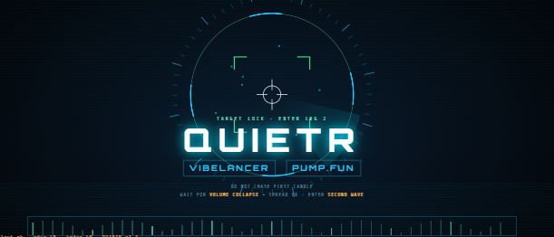
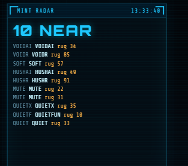
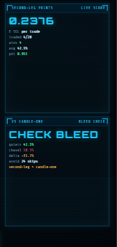

# QUIETR

**Desk 7** for [vibelancer](https://x.com) × [pump.fun](https://pump.fun) — a Solana targeting HUD that refuses the first candle.

> Don't chase the open. Wait for **silence** after the first dump. Enter the **second wave**.



---

## Why it exists

Most desks print the first green candle and bleed the dump.  
**QUIETR** flips that:

1. **Ignore** candle one  
2. **Arm** when the dump prints hard enough  
3. **Hold** while volume collapses and spread stays clean  
4. **Enter** only when the second leg lifts off the floor  

Less candle-one bleed. More second-leg prints. All in **SOL**.

| panel | job |
|-------|-----|
| Mint radar | live SOL pool + rug score |
| Silence gates | dump % · vol collapse · spread bps · hold bars |
| Second-leg prints | expectancy · hit · pnl in SOL |
| Vs candle-one | quietr avg vs chase-first bleed delta |





---

## Mechanic

```text
01 FIRST CANDLE   → IGNORE
02 DUMP LEG       → ARM  (drop ≥ threshold)
03 SILENCE        → vol ≤ X% of dump avg + spread ok + hold N bars
04 SECOND WAVE    → enter on lift off dump floor
```

Paper tape only. No wallet keys. Calibrate on yesterday → ship rules for today.

---

## Run

```bash
npm run desk        # http://localhost:5180  · 1920×1080 HUD
npm run demo        # quietr vs chase-first contrast
npm run calibrate   # → data/next-rules.json
npm run replay
```

Desk buttons (**RUN DEMO / CALIBRATE / REPLAY**) call the same engine as the CLI (`src/engine.mjs`).

---

## Visual

AJDesign-style **targeting HUD** on a 60-second loop:

- VIBELANCER + PUMP.FUN frames sit **above** the QUIETR lock title  
- Under the title: waveform + orbit blips + triple crawl tape  
- Rotating ticks, radar sweep, lock brackets, scanlines, path trace  
- Side panels keep text in motion (row slide · number flick · vertical radar scroll)

Labels: **QUIETR** · **VIBELANCER** · **PUMP.FUN** · **SOL**

---

## Stack

Vanilla HTML/CSS/Canvas + Node 18 ESM CLI. MIT.

```
quietr/
  index.html      ← 1920 HUD
  src/engine.mjs  ← silence → second-leg logic
  src/cli.mjs
  assets/         ← desk stills
```
